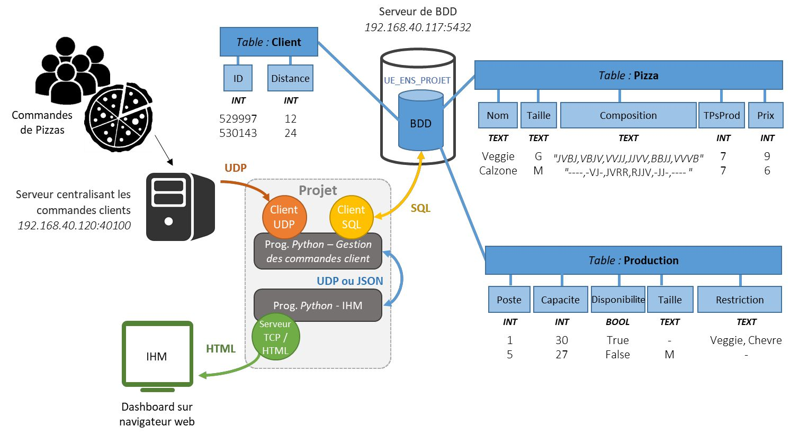

# 🍕 Projet Réseau - Système de Gestion de Pizzeria

Ce projet est une application client-serveur Python conçue pour simuler et gérer un flux de commandes de pizzas en temps réel. Il intègre des protocoles réseaux (UDP/TCP), une base de données SQL, et surtout **une logique algorithmique avancée** pour l'optimisation de la production et des livraisons.



## 🧠 Logique et Algorithmes Implémentés

Le cœur du projet réside dans `order_processor.py` et `production.py`. Contrairement à un système "Premier arrivé, Premier servi" (FIFO) basique, ce système utilise des techniques d'ordonnancement temps réel pour maximiser le taux d'acceptation des commandes.

### 1. Gestion de Flux par Lots (Batch Processing)
Plutôt que de traiter chaque paquet UDP individuellement dès sa réception, le système utilise un **buffer** intelligent.
- **Logique** : Les commandes entrantes sont stockées temporairement dans un tampon.
- **Déclencheur** : Le traitement du lot se lance si :
  - Le tampon est plein (`BATCH_SIZE = 4` commandes).
  - OU si le temps d'attente maximum est écoulé (`BUFFER_TIMEOUT = 12.0s`).
- **Intérêt** : Cela permet d'accumuler plusieurs commandes pour pouvoir les **trier** et les prioriser avant de les assigner aux fours.

### 2. Algorithme de Priorisation "Least Slack Time"
Une fois un lot constitué, les commandes ne sont pas traitées dans l'ordre d'arrivée, mais selon leur **urgence réelle**.
- **Calcul du Slack (Marge)** :
  $$\text{Slack} = (\text{Heure Livraison Client}) - (\text{Heure Actuelle} + \text{Temps Prod} + \text{Temps Trajet})$$
- **Tri** : Le système trie le lot par marge croissante. Les commandes ayant le moins de marge de manœuvre (les plus critiques) sont tentées en premier.
- **Résultat** : On évite de bloquer un four pour une commande livrable dans 2h alors qu'une commande urgente risque d'être refusée.

### 3. Planification de Production Parallèle
La gestion des fours (`production.py`) va au-delà d'une simple disponibilité binaire (Libre/Occupé). Chaque poste de production gère une **capacité parallèle** (ex: un four peut cuire 30 pizzas simultanément).
- **Vérification par Intervalle** : Lorsqu'une commande est testée, l'algorithme `calculate_earliest_start` vérifie si la capacité du four est suffisante **sur toute la durée de la cuisson**, en tenant compte des autres pizzas qui commencent ou finissent pendant cet intervalle.
- **Contraintes** : Le système respecte également :
  - Les restrictions d'ingrédients (ex: Allergies/Poste spécialisé).
  - Les tailles supportées par le poste (M ou G).
  - La disponibilité technique du poste.

## 🚀 Fonctionnalités Principales

* **Réception Broadcast UDP** : Écoute passive du flux de commandes sur le réseau local.
* **Base de Données PostgreSQL** : Stockage persistant des clients, du catalogue de pizzas et de la configuration des postes de production.
* **Validation de Faisabilité** : Rejet automatique si le temps de trajet + production dépasse l'heure souhaitée par le client.
* **Interface Web (WIP)** : Serveur TCP/HTML pour visualiser les statistiques (en cours de développement).

## 🛠️ Technologies utilisées et structure du code

- Language: Python 3
- Database: PostgreSQL 
- Python Libraries: psycopg2 (DB connection), socket (UDP/TCP networking)

```
networking-project/
├── pizzeria/
│   ├── classes
|   |   ├── __init__.py
|   |   ├── client.py
|   |   ├── database.py
|   |   ├── network.py
|   |   ├── order.py
|   |   ├── pizza.py
|   |   └── production.py
│   └── order_processor.py
│
├── server/
│   ├── __init__.py
│   ├── init.sql                # DB initializer
│   ├── order_broadcaster.py    # Order generator
│   └── dock_restart.bash       # Docker reloader
│
├── web/
│   ├── tcp_html.py             # (Future) Admin dashboard
│
└── main.py
```

## 📋 Prérequis

* **Python 3.x**
* **Docker** (pour la base de données)
* Bibliothèque `psycopg2-binary` :
    ```bash
    pip install psycopg2-binary
    ```

## ⚙️ Installation et Lancement

1.  **Démarrer la Base de Données** :
    ```bash
    chmod +x server/docker_restart.bash
    ./server/docker_restart.bash
    ```
    *Cela lance un conteneur Docker PostgreSQL et injecte le schéma `init.sql`.*

2.  **Lancer le Simulateur de Commandes** (dans un terminal séparé) :
    ```bash
    python server/order_broadcaster.py
    ```

3.  **Lancer le Gestionnaire de Pizzeria** :
    ```bash
    python main.py
    ```
    
## 📈 Pistes d'Amélioration

- [ ] **IHM Web Avancée** : Connecter le module `tcp_html.py` aux données temps réel du `order_processor` pour un tableau de bord dynamique.
- [x] **File d'Attente Globale** : Si tous les postes sont pleins, mettre la commande en attente plutôt que de la rejeter immédiatement.
- [ ] **Gestion Multi-Pizzas** : Optimiser le regroupement pour qu'un client commandant 4 pizzas les reçoive toutes chaudes en même temps (synchronisation de fin de cuisson).
